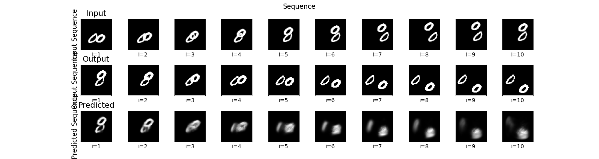

# Forecasting with a UNet

This repository contains a UNet model for moving MNIST sequence forecasting [Source](http://arxiv.org/abs/1502.04681). The goal is to predict future positions for the digits from past observations using deep learning. The project is written with Flax + nnx.

---

## Dataset

The data consists of grayscale images with shape `(seq_len, height, width)`. Each sample has 20 frames of moving handwritten digits, and the first 10 are used as input to the model and the last 10 are used as prediction target. In total, the dataset contains 10,000 sequences.

Example:


### Download

1. The data can be downloaded from [here](https://www.cs.toronto.edu/~nitish/unsupervised_video/) (782 Mb)
2. Download the data into the folder `data/`

Example:

```bash
mkdir -p data/
cd data
wget https://www.cs.toronto.edu/~nitish/unsupervised_video/mnist_test_seq.npy
```

## Setup
Create a Python environment and install dependencies:
```
python3 -m venv venv
source venv/bin/activate
pip install -e .
```

## Training
Run the training script with, e.g.,
```
python train.py --epochs 5 --batch-size 8
````
This will run the training, save the final model to `weights/`, and generate a few sample predictions with the final trained model. It will also save the F1 score as a function of leadtime to `figures/` along with the predictions.

## Results
The model is fast to train with a single GPU, taking only a few minutes to get a somewhat reasonable accuracy. The accuracy naturally decays with increasing leadtime as expected. The figure below shows the F1 score as a function of leadtime for the trained model.


A couple random predictions are also shown below and it's clear that the first few timesteps are accurately predicted where as later timesteps appear more blurred.



## TODO
- Temporal Attention Mechanisms for 
    - Integrate self-attention or transformer layers on the temporal dimension to better model long-range dependencies in the input sequence.

- Uncertainty estimation for the predictions
